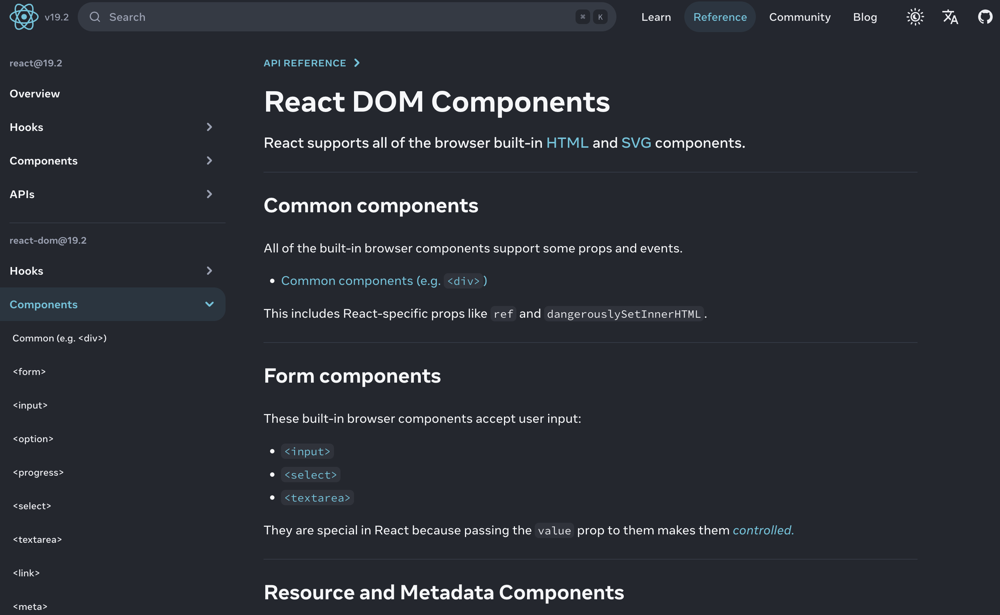
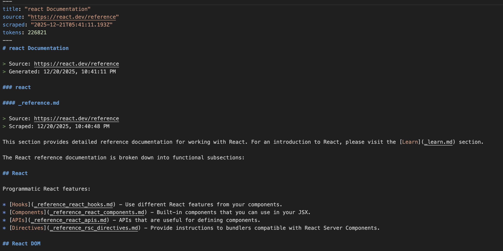

# SlurpAI

<div align="center">

https://github.com/ratacat/slurpai/raw/main/assets/slurp.mp4

*Convert entire documentation sites into AI-ready markdown*

</div>

SlurpAI is a CLI tool that scrapes documentation websites and compiles them into clean markdown files. Including relevant docs in your AI context helps coding agents make fewer mistakes and hallucinations.

<table>
<tr>
<td width="50%">

<p align="center"><em>Before: React docs website</em></p>
</td>
<td width="50%">

<p align="center"><em>After: Clean markdown file</em></p>
</td>
</tr>
</table>

## Convert a Documentation Site to Markdown

- **Configurable spider** — starts from any URL and follows internal links. See [Configuration](#configuration-optional) for filtering and tuning options.
- **Content extraction** — strips navigation, sidebars, footers, and other noise, keeping only the documentation content.
- **Flexible output** — compiles pages into a single markdown file or keeps them separate.
- **Fast and lightweight** — async scraping with configurable concurrency. No external services required.
- **No AI used** — pure Node.js scraping. SlurpAI is *for* AI, it doesn't *use* AI.

## Installation

```bash
npm install -g slurp-ai
```

**Prerequisites:** Node.js v20 or later

**Windows:** Works natively. Installing via npm automatically generates the `slurp` command wrappers.

## Usage

```bash
# Scrape documentation from any URL
slurp https://expressjs.com/en/4.18/

# With base path filtering (only follow links under /docs/)
slurp https://example.com/docs/introduction --base-path https://example.com/docs/
```

### What Happens

1. Starts at the provided URL and discovers internal links
2. Scrapes each page, converting HTML to clean markdown
3. Removes navigation, headers, footers, and duplicate content
4. Compiles everything into a single file in `slurps/` (e.g., `expressjs_docs.md`)

## Configuration (Optional)

Customize behavior by modifying `config.js` in the project root:

### File System Paths

| Property    | Default           | Description                                       |
| ----------- | ----------------- | ------------------------------------------------- |
| `inputDir`  | `slurps_partials` | Directory for intermediate scraped markdown files |
| `outputDir` | `slurps`          | Directory for the final compiled markdown file    |
| `basePath`  | `<targetUrl>`     | Base path used for link filtering (if specified)  |

### Web Scraping Settings

| Property          | Default | Description                                        |
| ----------------- | ------- | -------------------------------------------------- |
| `maxPagesPerSite` | `100`   | Maximum pages to scrape per site (0 for unlimited) |
| `concurrency`     | `25`    | Number of pages to process concurrently            |
| `retryCount`      | `3`     | Number of times to retry failed requests           |
| `retryDelay`      | `1000`  | Delay between retries in milliseconds              |
| `useHeadless`     | `false` | Use headless browser for JS-rendered sites         |
| `timeout`         | `60000` | Request timeout in milliseconds                    |

### URL Filtering

| Property              | Default                        | Description                                            |
| --------------------- | ------------------------------ | ------------------------------------------------------ |
| `enforceBasePath`     | `true`                         | Only follow links starting with the effective basePath |
| `preserveQueryParams` | `['version', 'lang', 'theme']` | Query parameters to preserve when normalizing URLs     |

### Markdown Compilation

| Property              | Default | Description                                           |
| --------------------- | ------- | ----------------------------------------------------- |
| `preserveMetadata`    | `true`  | Preserve metadata blocks in markdown                  |
| `removeNavigation`    | `true`  | Remove navigation elements from content               |
| `removeDuplicates`    | `true`  | Attempt to remove duplicate content sections          |
| `similarityThreshold` | `0.9`   | Threshold for considering content sections duplicates |

### Base Path Explained

The URL argument is the *starting point*. The `--base-path` flag defines a prefix for *filtering* which links to follow.

```bash
# Only scrape /docs/ pages, but start from the introduction
slurp https://example.com/docs/introduction --base-path https://example.com/docs/
```

Links like `https://example.com/docs/advanced` are followed; `https://example.com/blog/post` is ignored.

## Alternative to Context7

SlurpAI is a lightweight alternative to tools like Context7. Rather than pulling large doc bundles automatically, SlurpAI lets you manually curate the docs you need and include them only when relevant. Less context means fewer mistakes during implementation.

## MCP Server Integration

SlurpAI MCP is in testing and included in this release.

## Contributing

Issues and pull requests welcome!

- Report issues: [https://github.com/ratacat/slurpai/issues](https://github.com/ratacat/slurpai/issues)
- Repository: [https://github.com/ratacat/slurpai](https://github.com/ratacat/slurpai)

## License

ISC
