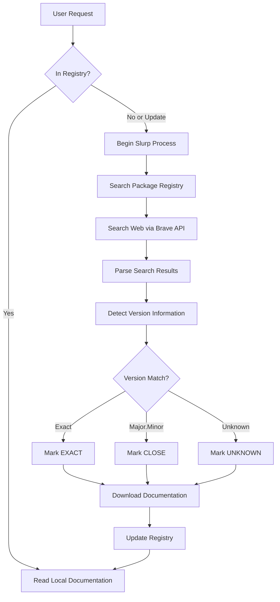

# SlurpAI - Documentation Scraper for AI Systems

## Project Overview
SlurpAI is a tool for automatically scraping web-based documentation and converting it to Markdown format optimized for AI consumption. It allows AI systems to access and utilize documentation without requiring manual content preparation.

## Core Functionality
- **Discovery**: Automatically discovers and maps documentation structure
- **Slurping**: Finds and fetches documentation for packages using web search
- **Extraction**: Pulls relevant content while ignoring navigation elements
- **Conversion**: Transforms HTML into clean, structured Markdown
- **Processing**: Handles multiple pages concurrently with retry logic
- **JS Support**: Can render JavaScript content via headless browser
- **Version Matching**: Determines package versions and finds matching documentation
- **Context Building**: Creates optimized context from docs and source code

## Technical Implementation
- Built in Node.js using:
  - axios for HTTP requests
  - cheerio for HTML parsing
  - puppeteer for JavaScript rendering
  - turndown for HTML-to-Markdown conversion
  - fs-extra for file operations
  - p-queue for concurrency control
- Configurable through command-line parameters
- Extensible for different documentation platforms

## Current State
- Successfully scrapes Flask documentation
- Preserves content structure and code blocks
- Handles pagination and link discovery
- Supports concurrent processing for speed
- Command-line interface with multiple options

## Integration Potential
- **Direct AI Integration**: Could be extended to directly feed content to AI systems
- **MCP Server**: Could evolve into an MCP server that provides documentation lookup tools
- **Vector Database**: Content could be stored in vector DB for semantic search
- **Project Dependency**: Could run as a dependency within other projects to provide documentation on demand

## Documentation Discovery Workflow

The process of finding and fetching documentation follows this workflow:



## Command Line Interface

```
slurp read <package> [version]    # Read local documentation
slurp fetch <package> [version]   # Find and download documentation
slurp list                        # List locally available documentation
slurp check [package.json path]   # Check all dependencies in package.json
slurp purge [package] [version]   # Remove documentation from cache
```

## Next Steps
1. **Brave Search integration**: Implement web search to find documentation sites
2. **Registry management**: Create minimal registry with package metadata
3. **CLI commands**: Implement the core read/fetch/list/check commands
4. **Parallel processing**: Add concurrent dependency processing with live status
5. **Version confidence**: Implement exact/close/unknown confidence levels
6. **Context building**: Extract and bundle source code with documentation
7. **MCP integration**: Create an MCP server wrapper for AI access
8. **Site-specific optimizations**: Add configurations for popular doc platforms
9. **Content processing improvements**: Enhance markdown conversion quality

## Architecture
The project has a clean, modular architecture:

```
slurpai/
├── index.js                # Main CLI entry point with argument parsing
├── src/
│   ├── DocsToMarkdown.js   # Core content extraction and markdown conversion
│   ├── LocalRegistryLookup.js # Local registry lookup for packages
│   ├── DocSlurper.js       # Web search-based documentation discovery
│   └── ContextBuilder.js   # Context creation for AI consumption (planned)
├── test.js                 # Test script for quick verification
├── test-registry-lookup.js # Test script for local registry lookup
├── test-slurper.js         # Test script for doc slurper with web search
├── test-docs/              # Output directory for test results
├── data/
│   ├── doc_sites.json      # Reference registry of documentation sites
│   └── registry.json       # User-specific documentation registry
└── slurps_docs/            # Documentation storage
    └── [library-name]/     # Subdirectory for each library
        └── [version]/      # Subdirectory for each version
```

### Storage Structure
Documentation is stored in a hierarchical structure:
- Each **library** gets its own directory
- Each **version** of a library gets a subdirectory
- All markdown files for that specific version are stored within

### Registry Format
The registry uses a minimal JSON structure to store metadata:

```json
{
  "packages": {
    "express": {
      "versions": {
        "4.18.2": {
          "documentationUrls": [
            {
              "url": "https://expressjs.com/en/4.18/",
              "type": "official",
              "confidence": "EXACT"
            },
            {
              "url": "https://github.com/expressjs/express/tree/4.18.2",
              "type": "repository",
              "confidence": "EXACT"
            }
          ],
          "lastUpdated": "2025-03-28T14:45:00.000Z"
        }
      },
      "registryUrl": "https://www.npmjs.com/package/express",
      "repositoryUrl": "https://github.com/expressjs/express"
    }
  }
}
```

## Configuration Options
The scraper is highly configurable through command-line parameters:

| Option | Command Line Flag | Description | Default |
|--------|------------------|-------------|---------|
| Base URL | `--url` | The URL of the documentation site to scrape | `https://flask.palletsprojects.com/en/stable/` |
| Output Directory | `--output` | Directory to save the Markdown files | `./docs` |
| Max Pages | `--max` | Maximum number of pages to scrape (0 for unlimited) | `0` |
| Headless Mode | `--headless` | Whether to use headless browser for JS content | `true` |
| Concurrency | `--concurrency` | Number of pages to scrape concurrently | `5` |
| Retry Count | `--retry-count` | Number of times to retry failed requests | `3` |
| Retry Delay | `--retry-delay` | Delay between retries in milliseconds | `1000` |

## Output Format
The scraper produces Markdown files with YAML frontmatter containing metadata:

```markdown
---
url: https://flask.palletsprojects.com/en/stable/quickstart/
scrapeDate: 2025-03-28T13:45:00.000Z
library: flask
version: 2.0.1
exactVersionMatch: true
---

# Quickstart

This page provides a quick introduction to Flask...
```

## Key Challenges and Solutions
- **Content Extraction**: Using targeted CSS selectors to identify main content
- **Link Discovery**: Intelligent crawling with domain filtering
- **Concurrency**: Managing parallel processing with retry logic
- **Format Conversion**: Preserving code blocks and formatting during HTML-to-Markdown conversion
- **Version Detection**: Parsing documentation sites to determine available versions
- **Package Analysis**: Reading and interpreting package.json for dependency information
- **Documentation Location**: Finding the correct documentation site for a given package
- **Context Building**: Extracting and bundling source code with documentation

## Brave Search Integration

The documentation discovery process uses the Brave Search API to find relevant documentation:

### API Implementation
- Uses the Brave Search API via the `/search` endpoint
- Requires API key stored in `.env` or config file
- Typical request format:
  ```javascript
  const response = await axios.get('https://api.search.brave.com/res/v1/web/search', {
    headers: { 'X-Subscription-Token': apiKey },
    params: {
      q: searchQuery,
      count: 10
    }
  });
  ```

### Documentation Search Query Construction
Targeted search queries using patterns like:
- `"{packageName} documentation"`
- `"{packageName} {version} docs site"`
- `"{packageName} API reference"`
- `"{packageName} developer guide"`

### Documentation Site Recognition Heuristics
Documentation sites are identified using a weighted scoring system:

1. **URL Pattern Matching** (highest confidence)
   - URLs containing `/docs/`, `/documentation/`, `/guide/`, `/api/`
   - Domain patterns like `docs.*.com`, `*.readthedocs.io`, `*.dev/docs`
   - Package name in subdomain: `{package}.dev`, `{package}.org/docs`

2. **Title/Description Analysis** (medium confidence)
   - Titles containing "Documentation", "API Reference", "Developer Guide"
   - Description containing phrases like "official docs", "reference manual"
   - Package name + version number in title/description

3. **Known Documentation Platforms** (high confidence)
   - ReadTheDocs, GitHub Pages, GitHub Wiki
   - Language-specific platforms (PyPI Documentation, RubyDoc, etc.)
   - Generated documentation tools (JSDoc, Sphinx, etc.)

4. **Domain Trust Assessment**
   - Official company/package domains
   - GitHub/GitLab repository pages
   - Known documentation hosting services

### Result Ranking & Filtering
Potential documentation sites are ranked using:
1. Score from the above heuristics (weighted combination)
2. Brave's own ranking (position in results)
3. Presence of version information matching the requested version
4. Preference for official sources over third-party content

### Documentation URL Validation
Before confirming a site as valid documentation:
1. Make a test HTTP request to verify accessibility
2. Check for common documentation structures in the page
3. Scan for version information to assess confidence level
4. Look for indicators of complete documentation (navigation, multiple pages)

## Context Building

In addition to documentation, SlurpAI can create context from source code:

- **Source Code Integration**: Extract relevant code from node_modules folder
- **Intelligent Selection**: Focus on key implementation files
- **Bundling**: Package documentation and source code together
- **AI Optimization**: Structure content for optimal AI consumption
- **Minimal Overhead**: Keep context concise and focused on essential information
