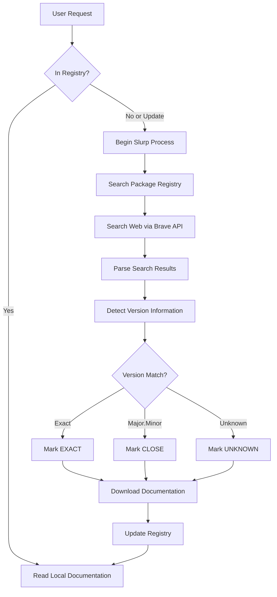
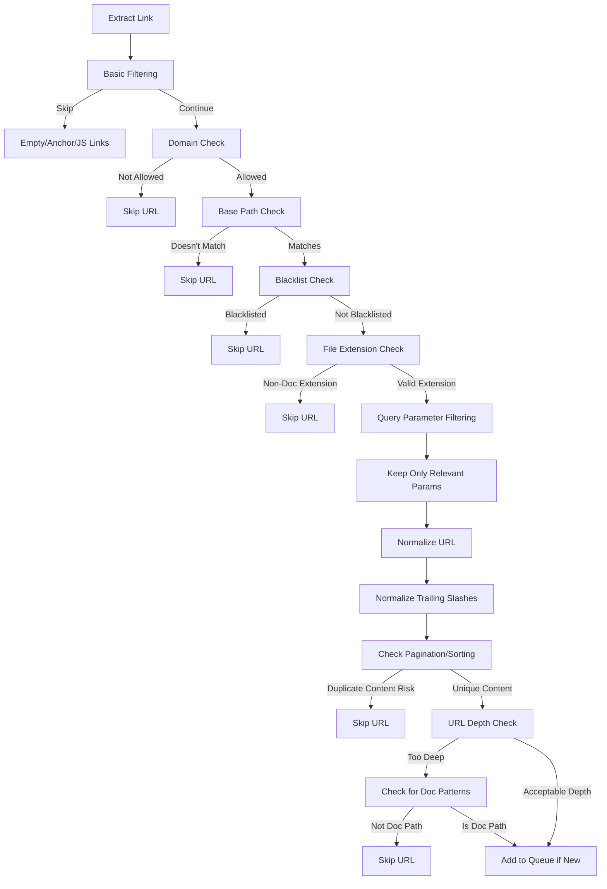
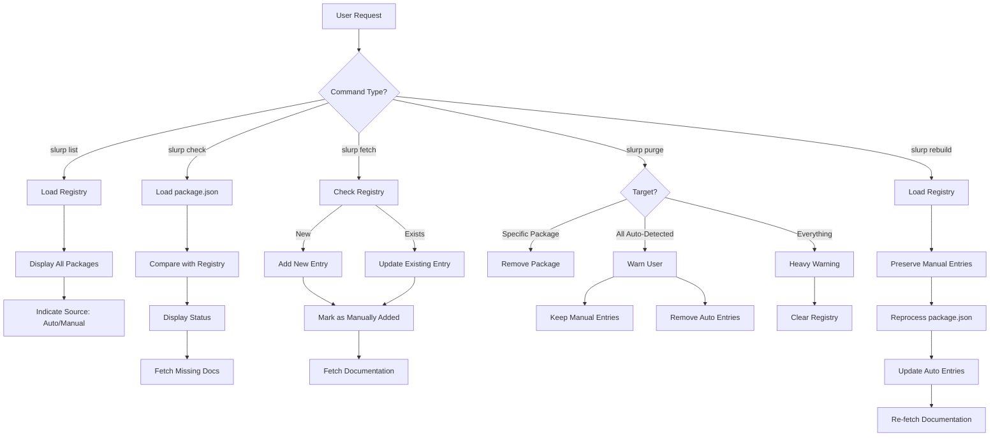

# SlurpAI - Documentation Scraper for AI Systems

## Project Overview
SlurpAI is a tool for automatically scraping web-based documentation and converting it to Markdown format optimized for AI consumption. It allows AI systems to access and utilize documentation without requiring manual content preparation.

## Core Functionality
- **Discovery**: Automatically discovers and maps documentation structure
- **Slurping**: Finds and fetches documentation for packages using web search
- **Extraction**: Pulls relevant content while ignoring navigation elements
- **Conversion**: Transforms HTML into clean, structured Markdown
- **Processing**: Handles multiple pages concurrently with retry logic
- **JS Support**: Can render JavaScript content via headless browser
- **Version Matching**: Determines package versions and finds matching documentation
- **Context Building**: Creates optimized context from docs and source code

## Technical Implementation
- Built in Node.js using:
  - axios for HTTP requests
  - cheerio for HTML parsing
  - puppeteer for JavaScript rendering
  - turndown for HTML-to-Markdown conversion
  - fs-extra for file operations
  - p-queue for concurrency control
- Configurable through command-line parameters
- Extensible for different documentation platforms

## Current State
- Successfully scrapes Flask documentation
- Preserves content structure and code blocks
- Handles pagination and link discovery
- Supports concurrent processing for speed
- Command-line interface with multiple options

## Integration Potential
- **Direct AI Integration**: Could be extended to directly feed content to AI systems
- **MCP Server**: Could evolve into an MCP server that provides documentation lookup tools
- **Vector Database**: Content could be stored in vector DB for semantic search
- **Project Dependency**: Could run as a dependency within other projects to provide documentation on demand

## Documentation Discovery Workflow

The process of finding and fetching documentation follows this workflow:



## Command Line Interface

```
slurp read <package> [version]    # Read local documentation
slurp fetch <package> [version]   # Find and download documentation
slurp list                        # List locally available documentation
slurp check [package.json path]   # Check all dependencies in package.json
slurp purge [package] [version]   # Remove documentation from cache
```

## Next Steps
1. **Brave Search integration**: Implement web search to find documentation sites
2. **Registry management**: Create minimal registry with package metadata
3. **CLI commands**: Implement the core read/fetch/list/check commands
4. **Parallel processing**: Add concurrent dependency processing with live status
5. **Version confidence**: Implement exact/close/unknown confidence levels
6. **Context building**: Extract and bundle source code with documentation
7. **MCP integration**: Create an MCP server wrapper for AI access
8. **Site-specific optimizations**: Add configurations for popular doc platforms
9. **Content processing improvements**: Enhance markdown conversion quality
10. **Improve table UI rendering**: Replace cli-table3 or enhance implementation to:
    - Fix column width calculations that don't handle Unicode properly
    - Improve progress bar rendering to prevent distortion
    - Consider terminal-kit, blessed, or ink for better table handling
11. **Enhance package registry lookup**:
    - Fix case-sensitivity in name matching (registry has "Axios", code looks for "axios")
    - Normalize package names between registry entries and lookups
    - Improve handling of scoped packages (@org/package)
12. **✅ URL filtering enhancements**:
    - Implement intelligent URL preprocessing to filter out non-documentation pages
    - Add configurable URL blacklist patterns to skip irrelevant content
    - Preserve only meaningful query parameters to avoid duplicate content
    - Enforce base path to keep scraping within relevant documentation sections
    - Filter out non-documentation file extensions (.pdf, .zip, etc.)
    - Normalize trailing slashes to prevent duplicate content
    - Handle pagination and sorting parameters to avoid redundant pages
    - Implement URL depth checking with documentation path detection
13. **✅ Documentation compilation**:
    - Create a utility to compile all scraped markdown files into a single consolidated file
    - Remove navigation elements, empty spaces, and other non-content elements
    - Organize content logically by library and version
    - Implement duplicate content detection and removal
    - Preserve essential metadata while removing clutter
    - Provide CLI interface with configurable options

## Architecture
The project has a clean, modular architecture:

```
slurpai/
├── index.js                # Main CLI entry point with argument parsing
├── compile.js              # CLI for compiling documentation into a single file
├── src/
│   ├── DocsToMarkdown.js   # Core content extraction and markdown conversion
│   ├── LocalRegistryLookup.js # Local registry lookup for packages
│   ├── DocSlurper.js       # Web search-based documentation discovery
│   ├── MarkdownCompiler.js # Compiles markdown files into a single document
│   └── ContextBuilder.js   # Context creation for AI consumption (planned)
├── test.js                 # Test script for quick verification
├── test-registry-lookup.js # Test script for local registry lookup
├── test-slurper.js         # Test script for doc slurper with web search
├── test-docs/              # Output directory for test results
├── data/
│   ├── doc_sites.json      # Reference registry of documentation sites
│   └── registry.json       # User-specific documentation registry
└── slurps_docs/            # Documentation storage
    └── [library-name]/     # Subdirectory for each library
        └── [version]/      # Subdirectory for each version
```

### Storage Structure
Documentation is stored in a hierarchical structure:
- Each **library** gets its own directory
- Each **version** of a library gets a subdirectory
- All markdown files for that specific version are stored within

### Registry Format
The registry uses a minimal JSON structure to store metadata:

```json
{
  "packages": {
    "express": {
      "versions": {
        "4.18.2": {
          "documentationUrls": [
            {
              "url": "https://expressjs.com/en/4.18/",
              "type": "official",
              "confidence": "EXACT"
            },
            {
              "url": "https://github.com/expressjs/express/tree/4.18.2",
              "type": "repository",
              "confidence": "EXACT"
            }
          ],
          "lastUpdated": "2025-03-28T14:45:00.000Z"
        }
      },
      "registryUrl": "https://www.npmjs.com/package/express",
      "repositoryUrl": "https://github.com/expressjs/express"
    }
  }
}
```

## Configuration Options
The scraper is highly configurable through command-line parameters:

| Option | Command Line Flag | Description | Default |
|--------|------------------|-------------|---------|
| Base URL | `--url` | The URL of the documentation site to scrape | `https://flask.palletsprojects.com/en/stable/` |
| Output Directory | `--output` | Directory to save the Markdown files | `./docs` |
| Max Pages | `--max` | Maximum number of pages to scrape (0 for unlimited) | `0` |
| Headless Mode | `--headless` | Whether to use headless browser for JS content | `true` |
| Concurrency | `--concurrency` | Number of pages to scrape concurrently | `5` |
| Retry Count | `--retry-count` | Number of times to retry failed requests | `3` |
| Retry Delay | `--retry-delay` | Delay between retries in milliseconds | `1000` |

## Output Format

### Individual Markdown Files
The scraper produces Markdown files with YAML frontmatter containing metadata:

```markdown
---
url: https://flask.palletsprojects.com/en/stable/quickstart/
scrapeDate: 2025-03-28T13:45:00.000Z
library: flask
version: 2.0.1
exactVersionMatch: true
---

# Quickstart

This page provides a quick introduction to Flask...
```

### Compiled Documentation
The MarkdownCompiler produces a single consolidated file with organized content:

```markdown
# Compiled Documentation

Generated on 2025-03-31T20:21:45.000Z

## flask

### Version 2.0.1

#### quickstart.md

> Source: https://flask.palletsprojects.com/en/stable/quickstart/
> Scraped: 3/28/2025, 1:45:00 PM

# Quickstart

This page provides a quick introduction to Flask...

#### installation.md

> Source: https://flask.palletsprojects.com/en/stable/installation/
> Scraped: 3/28/2025, 1:46:30 PM

# Installation

Flask depends on the Werkzeug WSGI toolkit, the Jinja template...

## lodash

### Version 4.17.15

#### array.md

> Source: https://lodash.com/docs/4.17.15#chunk
> Scraped: 3/29/2025, 10:15:22 AM

# Array Methods

This section documents the array manipulation methods...
```

## Key Challenges and Solutions
- **Content Extraction**: Using targeted CSS selectors to identify main content
- **Link Discovery**: Intelligent crawling with domain filtering
- **Concurrency**: Managing parallel processing with retry logic
- **Format Conversion**: Preserving code blocks and formatting during HTML-to-Markdown conversion
- **Version Detection**: Parsing documentation sites to determine available versions
- **Package Analysis**: Reading and interpreting package.json for dependency information
- **Documentation Location**: Finding the correct documentation site for a given package
- **Context Building**: Extracting and bundling source code with documentation
- **Content Consolidation**: Compiling multiple markdown files into a single document
- **Navigation Removal**: Identifying and removing navigation elements and other non-content sections
- **Duplicate Detection**: Identifying and removing duplicate content across documentation files

## Brave Search Integration

The documentation discovery process uses the Brave Search API to find relevant documentation:

### API Implementation
- Uses the Brave Search API via the `/search` endpoint
- Requires API key stored in `.env` or config file
- Typical request format:
  ```javascript
  const response = await axios.get('https://api.search.brave.com/res/v1/web/search', {
    headers: { 'X-Subscription-Token': apiKey },
    params: {
      q: searchQuery,
      count: 10
    }
  });
  ```

### Documentation Search Query Construction
Targeted search queries using patterns like:
- `"{packageName} documentation"`
- `"{packageName} {version} docs site"`
- `"{packageName} API reference"`
- `"{packageName} developer guide"`

### Documentation Site Recognition Heuristics
Documentation sites are identified using a weighted scoring system:

1. **URL Pattern Matching** (highest confidence)
   - URLs containing `/docs/`, `/documentation/`, `/guide/`, `/api/`
   - Domain patterns like `docs.*.com`, `*.readthedocs.io`, `*.dev/docs`
   - Package name in subdomain: `{package}.dev`, `{package}.org/docs`

2. **Title/Description Analysis** (medium confidence)
   - Titles containing "Documentation", "API Reference", "Developer Guide"
   - Description containing phrases like "official docs", "reference manual"
   - Package name + version number in title/description

3. **Known Documentation Platforms** (high confidence)
   - ReadTheDocs, GitHub Pages, GitHub Wiki
   - Language-specific platforms (PyPI Documentation, RubyDoc, etc.)
   - Generated documentation tools (JSDoc, Sphinx, etc.)

4. **Domain Trust Assessment**
   - Official company/package domains
   - GitHub/GitLab repository pages
   - Known documentation hosting services

### Result Ranking & Filtering
Potential documentation sites are ranked using:
1. Score from the above heuristics (weighted combination)
2. Brave's own ranking (position in results)
3. Presence of version information matching the requested version
4. Preference for official sources over third-party content

### Documentation URL Validation
Before confirming a site as valid documentation:
1. Make a test HTTP request to verify accessibility
2. Check for common documentation structures in the page
3. Scan for version information to assess confidence level
4. Look for indicators of complete documentation (navigation, multiple pages)

## URL Filtering

SlurpAI implements intelligent URL filtering to ensure high-quality documentation scraping:

### URL Preprocessing Workflow

The URL filtering process follows this enhanced workflow:



### Base Path Enforcement

When enabled, this feature ensures that all scraped URLs contain the base path from the initial URL. For example, if scraping starts at `https://moleculer.services/docs/0.15/`, only URLs containing `/docs/0.15/` will be followed. This prevents the scraper from wandering into unrelated sections of the site.

### URL Blacklist

The scraper automatically filters out URLs containing patterns that typically lead to non-documentation content:

- Common non-documentation pages: `/blog/`, `/news/`, `/about/`, `/contact/`, etc.
- Social media and external services: `/twitter/`, `/github.com/`, `/discord/`, etc.
- E-commerce/marketing: `/store/`, `/pricing/`, `/subscribe/`, etc.
- User account related: `/login/`, `/account/`, `/profile/`, etc.
- Support/feedback: `/support/`, `/help-center/`, `/faq/`, etc.

### Query Parameter Handling

Many documentation sites use query parameters that aren't relevant to the content (tracking parameters, session IDs, etc.). SlurpAI preserves only meaningful parameters while discarding others to avoid duplicate content:

Parameters preserved by default:
- Version related: `version`, `v`, `ver`
- Language/localization: `lang`, `locale`, `language`
- Content display: `theme`, `view`, `format`
- API specific: `api-version`, `endpoint`, `namespace`
- Documentation specific: `section`, `chapter`, `topic`, etc.

### Benefits of URL Filtering

1. **Improved Documentation Quality**: By focusing only on relevant pages, the scraper produces cleaner, more focused documentation
2. **Reduced Processing Time**: Skipping irrelevant pages significantly reduces scraping time
3. **Lower Resource Usage**: Fewer pages means less memory and CPU usage
4. **Elimination of Duplicate Content**: Normalizing URLs prevents the same content from being processed multiple times
5. **Better AI Context**: The resulting documentation is more relevant and concise for AI consumption

## Context Building

In addition to documentation, SlurpAI can create context from source code:

- **Source Code Integration**: Extract relevant code from node_modules folder
- **Intelligent Selection**: Focus on key implementation files
- **Bundling**: Package documentation and source code together
- **AI Optimization**: Structure content for optimal AI consumption
- **Minimal Overhead**: Keep context concise and focused on essential information

## User Stories and Registry Management

SlurpAI manages documentation from two distinct sources of truth:

1. **Automatic Discovery**: Documentation fetched from package.json dependencies
2. **Manual Addition**: Documentation directly added by users with `slurp fetch`



### Key User Scenarios

1. **Comprehensive Documentation Management**

   **As a developer**, I want to fetch documentation for both my project dependencies AND external packages not in my package.json.
   
   **So that** I can have a complete set of documentation for all packages relevant to my project.
   
   **This means** SlurpAI must maintain a registry that tracks both automatic (package.json-based) and manually added documentation.

2. **Elegant Source Tracking**

   **As a developer**, I want to clearly see which documentation was automatically discovered and which was manually added.
   
   **So that** I can make informed decisions about which documentation to keep or update.
   
   **This means** SlurpAI must tag entries in the registry with their source (auto/manual) and display this information in the `slurp list` output.

3. **Selective Documentation Maintenance**

   **As a developer**, I want to purge specific documentation entries without losing my manually added ones.
   
   **So that** I can keep my documentation storage clean and relevant.
   
   **This means** SlurpAI needs distinct commands:
   - `slurp purge <package> [version]` - Remove specific package documentation
   - `slurp purge --auto-only` - Remove only automatically added entries
   - `slurp purge --all` - Remove all entries (with clear warning)

4. **Documentation Rebuilding**

   **As a developer**, I want to refresh all my project dependency documentation while preserving manually added entries.
   
   **So that** I can update documentation without losing valuable manual additions.
   
   **This means** SlurpAI needs a `slurp rebuild` command that preserves manual entries while refreshing package.json-based ones.

### Registry Design

The registry must be designed to fail gracefully and track the origin of each documentation entry:

```json
{
  "packages": {
    "express": {
      "source": "auto",
      "addedAt": "2025-03-28T14:45:00.000Z",
      "versions": {
        "4.18.2": {
          "documentationUrls": [
            {
              "url": "https://expressjs.com/en/4.18/",
              "type": "official",
              "confidence": "EXACT"
            }
          ],
          "lastUpdated": "2025-03-28T14:45:00.000Z"
        }
      }
    },
    "lodash": {
      "source": "manual",
      "addedAt": "2025-03-28T15:30:00.000Z",
      "versions": {
        "4.17.21": {
          "documentationUrls": [
            {
              "url": "https://lodash.com/docs/4.17.21",
              "type": "official",
              "confidence": "EXACT"
            }
          ],
          "lastUpdated": "2025-03-28T15:30:00.000Z"
        }
      }
    }
  }
}
```

This enhanced registry design adds:

1. **Source tracking** (`auto` vs `manual`)
2. **Addition timestamp** to track when entries were added
3. Clear separation between versions and package metadata

All commands will respect this dual-source paradigm, providing a seamless experience while maintaining clear boundaries between automatically discovered and manually added documentation.
